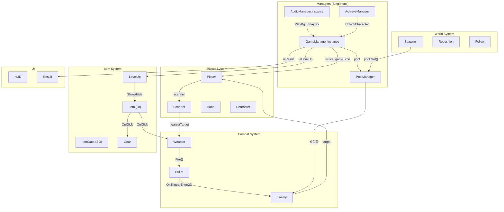

# Architecture

## 프로젝트 아키텍처

### 전체 시스템 다이어그램



### 코드 조직

스크립트는 기능별로 분류됩니다:

```
코드 레이어 구조:

┌─────────────────────────────────────────┐
│           GameManager (싱글턴)            │
│  게임 상태, 시간, 점수, 레벨 관리         │
├─────────────────┬───────────────────────┤
│  Player System  │  Combat System        │
│  Player.cs      │  Weapon.cs            │
│  Character.cs   │  Bullet.cs            │
│  Scanner.cs     │  Enemy.cs             │
│  Hand.cs        │  Spawner.cs           │
├─────────────────┼───────────────────────┤
│  Item System    │  Infrastructure       │
│  ItemData.cs    │  PoolManager.cs       │
│  Item.cs        │  AudioManager.cs      │
│  Gear.cs        │  AchieveManager.cs    │
│  LevelUp.cs     │  Reposition.cs        │
├─────────────────┴───────────────────────┤
│               UI Layer                   │
│  HUD.cs, Follow.cs, Result.cs           │
└─────────────────────────────────────────┘
```

### 싱글턴 패턴

`GameManager`와 `AudioManager`는 싱글턴으로 구현되어 전역 접근이 가능합니다:

```csharp
// GameManager.cs
public static GameManager instance;
void Awake() { instance = this; }

// AudioManager.cs
public static AudioManager instance;
void Awake() { instance = this; Init(); }
```

모든 스크립트에서 `GameManager.instance.isLive` 등으로 게임 상태를 확인합니다.

### 데이터 관리 (ScriptableObject)

아이템 데이터는 Unity ScriptableObject로 관리됩니다:

```
Data/
├── Item 0.asset  → Melee 무기 (회전 검)
├── Item 1.asset  → Range 무기 (발사체)
├── Item 2.asset  → Glove (공격 속도)
├── Item 3.asset  → Shoe (이동 속도)
└── Item 4.asset  → Heal (체력 회복)
```

`[CreateAssetMenu(fileName = "Item", menuName = "Scriptable Object/ItemData")]`로 에디터에서 생성 가능합니다.

### 에셋 구조

```
프리팹 (Prefabs/):
  Enemy.prefab    — 적 프리팹 (RuntimeAnimatorController로 외형 변경)
  Bullet 0.prefab — 근접 투사체 (관통, per = -100)
  Bullet 1.prefab — 원거리 투사체 (관통 수 제한)

스프라이트 (Sprites/):
  Farmer 0~3.png  — 플레이어 캐릭터 스프라이트
  Enemy 0~4.png   — 적 스프라이트
  UI.png          — UI 스프라이트 아틀라스
  Props.png       — 소품 스프라이트
  Tiles.png       — 타일맵 스프라이트

오디오 (Audio/):
  BGM.wav         — 배경 음악
  Hit0/1.wav      — 피격 효과음
  Melee0/1.wav    — 근접 공격 효과음
  Range.wav       — 원거리 공격 효과음
  LevelUp.wav     — 레벨업 효과음
  Select.wav      — 선택 효과음
  Win/Lose.wav    — 승리/패배 효과음
  Dead.wav        — 사망 효과음
```

### 오브젝트 풀링 (PoolManager)

```csharp
public class PoolManager : MonoBehaviour {
    public GameObject[] prefabs;  // 풀링할 프리팹 배열
    List<GameObject>[] pools;     // 프리팹별 풀 리스트

    public GameObject Get(int index) {
        // 비활성 오브젝트 검색 → 있으면 재활용
        // 없으면 Instantiate → 풀에 추가
    }
}
```

`GameManager.instance.pool.Get(0)`으로 적(Enemy) 인스턴스를 가져옵니다.

### Input System

`Player.inputactions` 파일로 Unity New Input System을 사용합니다:

```csharp
// Player.cs
void OnMove(InputValue value) {
    inputVec = value.Get<Vector2>();
}
```

조이스틱과 키보드 모두 지원됩니다 (`uiJoy` Transform 참조).

### 무한 월드 (Reposition)

`Reposition.cs`는 타일맵 청크를 플레이어 이동에 따라 재배치합니다:

```
OnTriggerExit2D(collision):
  if collision.tag != "Area": return
  
  플레이어와의 거리 계산
  X 차이 > Y 차이 → X 방향으로 40만큼 이동
  X 차이 < Y 차이 → Y 방향으로 40만큼 이동
  
  "Enemy" 태그인 경우:
  → 스폰 포인트 위치로 재배치
```

이로 인해 무한히 움직이는 것처럼 느껴지는 월드를 구현합니다.
