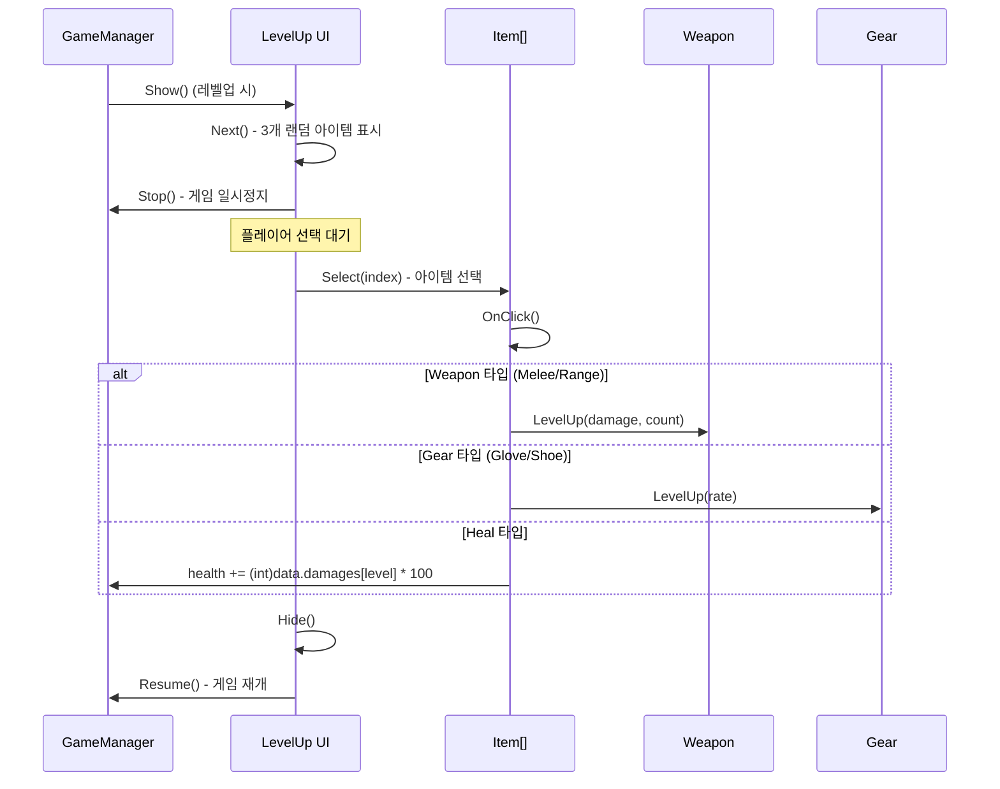

# Game Systems

## 전투 시스템

### 무기 (Weapon.cs)

무기는 두 가지 타입으로 동작합니다:

#### 근접 무기 (id = 0)

```
Update():
  transform.Rotate(Vector3.back * speed * Time.deltaTime)
  → 플레이어 주위를 회전하며 적과 충돌
  → Bullet(per = -100)이 장착됨 (무한 관통)
```

```
시각화:
        ★ Bullet
      /
  Player ──★
      \
        ★
  (회전하며 적 타격)
```

#### 원거리 무기 (id = 1+)

```
Update():
  timer += Time.deltaTime
  if timer > speed:
    Fire()
    → Scanner에서 nearestTarget 가져오기
    → 방향 벡터 계산
    → Bullet 생성 및 발사 (velocity = dir * 15f)
    → per 값에 따라 관통 수 제한
```

#### 무기 레벨업

```csharp
public void LevelUp(float damage, int count) {
    this.damage = damage;
    this.count = count;
    
    if (id == 0) Batch();  // 근접 무기: 투사체 재배치
    
    // Gear 기반 속도/비율 적용
    player.BroadcastMessage("ApplyGear", ...);
}
```

### 총알 (Bullet.cs)

| 속성 | 설명 |
|------|------|
| `damage` | 대미지 |
| `per` | 관통 횟수 (-100: 무한, 0+: 소진 후 비활성화) |

```csharp
void OnTriggerEnter2D(Collider2D collision) {
    if (!collision.CompareTag("Enemy") || per == -100) return;
    per--;
    if (per < 0) {
        rigid.velocity = Vector2.zero;
        gameObject.SetActive(false);  // 풀로 반환
    }
}
```

### 적 (Enemy.cs)

적은 `RuntimeAnimatorController[]`로 외형이 결정됩니다.

```
Init(SpawnData data):
  speed = data.speed
  maxHealth = data.health
  health = data.health
  animCon 설정 → 외형 변경

FixedUpdate():
  dirVec = target.position - rigid.position
  rigid.MovePosition(rigid.position + dirVec.normalized * speed * Time.fixedDeltaTime)
  
  스프라이트 방향:
  spriter.flipX = (target.position.x < rigid.position.x)
```

**피격 처리 (Coroutine):**

```
OnTriggerEnter2D(collision):
  if collision.tag == "Bullet":
    health -= collision.GetComponent<Bullet>().damage
    if health > 0:
      anim.SetTrigger("Hit")
      KnockBack() (코루틴)
    else:
      Dead()
      → isLive = false
      → GameManager.kill++, GetExp()
      → SetActive(false)
      → AudioManager.PlaySfx(Sfx.Dead)
```

### 캐릭터 특성 (Character.cs)

static 프로퍼티로 `GameManager.instance.playerId`에 따라 보너스를 계산합니다:

```csharp
public static float Speed     => playerId == 0 ? 1.1f : 1f;
public static float WeaponSpeed => playerId == 1 ? 1.1f : 1f;
public static float WeaponRate  => playerId == 1 ? 0.9f : 1f;
public static float Damage     => playerId == 2 ? 1.2f : 1f;
public static int Count        => playerId == 3 ? 1 : 0;
```

## 스폰 시스템

### Spawner.cs

시간 기반으로 적의 종류와 빈도가 변합니다:

```csharp
public SpawnData[] spawnData;  // 레벨별 스폰 설정
public float levelTime;         // 레벨 전환 주기

void Awake() {
    levelTime = GameManager.instance.maxGameTime / spawnData.Length;
}

void Update() {
    level = Min(FloorToInt(gameTime / levelTime), spawnData.Length - 1);
    if (timer > spawnData[level].spawnTime) {
        Spawn();
        timer = 0;
    }
}

void Spawn() {
    enemy = pool.Get(0);
    enemy.position = spawnPoint[Random.Range(1, spawnPoint.Length)].position;
    enemy.Init(spawnData[level]);
}
```

`SpawnData` 구조체:

```csharp
[System.Serializable]
public class SpawnData {
    public float spawnTime;    // 스폰 간격
    public int spriteType;     // 적 스프라이트 종류
    public int health;         // 적 체력
    public float speed;        // 적 이동 속도
}
```

### 적 탐색 (Scanner.cs)

CircleCast로 범위 내 가장 가까운 적을 탐색합니다:

```csharp
void FixedUpdate() {
    targets = Physics2D.CircleCastAll(
        transform.position, scanRange, Vector2.zero, 0, targetLayer
    );
    nearestTarget = GetNearest();
}

Transform GetNearest() {
    // 모든 targets 중 가장 가까운 Transform 반환
}
```

## 아이템 시스템

### 레벨업 (LevelUp.cs)



### 장비 효과 (Gear.cs)

```
Gear.Init(data):
  type = data.itemType
  rate = data.damages[0]
  부모 = Player
  ApplyGear()

ApplyGear():
  switch type:
    Glove → RateUp(): 모든 Weapon의 speed *= rate
    Shoe  → SpeedUp(): Player의 speed += rate
```

## 오디오 시스템

### AudioManager.cs (싱글턴)

```
초기화:
  BGM: AudioSource (loop, 볼륨 조절)
  SFX: AudioSource[] (채널 수만큼 생성, 라운드로빈)
  
BGM 이펙트:
  AudioHighPassFilter (Camera에 부착)
  → 레벨업 UI 열 때 활성화 (음소거 효과)
  → 닫을 때 비활성화
```

```csharp
public enum Sfx {
    Dead, Hit, LevelUp = 3, Lose, Melee, Range = 7, Select, Win
}

public void PlaySfx(Sfx sfx) {
    sfxPlayers[channelIndex].clip = sfxClips[(int)sfx];
    sfxPlayers[channelIndex].Play();
    channelIndex = (channelIndex + 1) % channels;
}
```

## 업적 시스템

### AchieveManager.cs

`PlayerPrefs` 기반으로 캐릭터 해금을 관리합니다:

```csharp
enum Achieve { UnlockPotato, UnlockBean }

void Init() {
    PlayerPrefs.SetInt("MyData", 1);
    foreach (var achieve in achieves) {
        PlayerPrefs.SetInt(achieve.ToString(), 0);
    }
}

void UnlockCharacter() {
    // 업적 조건 체크 → 캐릭터 잠금 해제
    // lockCharacter[].SetActive(false)
    // unlockCharacter[].SetActive(true)
    // 알림 표시 (uiNotice)
}
```

## HUD 시스템

### HUD.cs

```csharp
public enum InfoType { Exp, Level, Kill, Time, Health }

void LateUpdate() {
    switch (type) {
        case Exp:    slider.value = curExp / maxExp;
        case Level:  text = "Lv.{level}";
        case Kill:   text = "{kill}";
        case Time:   slider.value = remainTime / maxGameTime;
        case Health: slider.value = health / maxHealth;
    }
}
```

각 HUD 요소는 독립적으로 InfoType을 설정하여 원하는 정보를 표시합니다.
